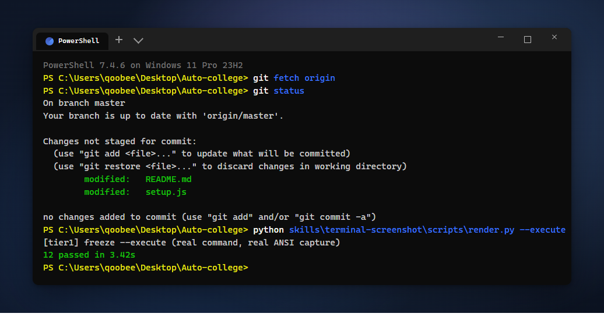

# Auto-college

聚焦大学课程场景的 Claude Code / Cursor Skills：**逼真终端截图**（核心）+
**实验报告** 流程。终端截图采用三档渲染架构，让真实终端引擎（[freeze](https://github.com/charmbracelet/freeze)、
[termframe](https://github.com/pambirus/termframe)）处理着色与排版，逼真度物理级。

Claude Code / Cursor skills focused on college coursework: **realistic terminal
screenshots** (core, three-tier rendering powered by real terminal engines) plus a
streamlined **lab report** workflow.

---

## 快速安装 / Quick Start

### 方式一：脚本一键安装（推荐）

在你的**项目根目录**下执行（需要 [Node.js](https://nodejs.org/)）：

```bash
curl -fsSL https://raw.githubusercontent.com/Piaoxuemoli/Auto-college/master/setup.js | node
```

脚本会自动完成：检测平台（Claude Code / Cursor）→ clone 仓库 → 复制 skills → 清理临时文件。

### 方式二：让 Agent 帮你装

```text
帮我从 https://github.com/Piaoxuemoli/Auto-college 安装 skills 到当前项目
```

### 安装后使用

重启 Agent，直接描述任务即可：

```text
把这段 PowerShell 输出渲染成终端截图
```

```text
根据实验手册生成实验报告，运行证据用终端截图
```

---

## Skills

### [terminal-screenshot](docs/terminal-screenshot.md)（核心）

终端命令输出 → 逼真 PNG 截图，三档渲染架构：

1. **Tier 1 — freeze 真实执行**：本机可执行的命令用
   [freeze](https://github.com/charmbracelet/freeze) 真实运行并捕获 ANSI 输出，字体/着色/间距物理级真实。
2. **Tier 2 — ANSI + termframe**：伪造内容（GPU 服务器、SSH 远程等）生成为 ANSI 转义序列，
   交给真实终端模拟器 [termframe](https://github.com/pambirus/termframe) 渲染（内置 iTerm2 主题与窗口样式）。
3. **Tier 3 — HTML 回退**：无外部工具时用高保真 HTML 模板 + 无头浏览器截图，
   模板吸收 freeze/codeshot 视觉体系（外圈背景、圆角、阴影）。

Render terminal outputs as realistic PNGs via a three-tier pipeline: real
execution through freeze, real-terminal-engine rendering through termframe for
forged content, and an HTML template fallback.



---

### [lab-report](docs/lab-report.md)

实验报告精简流程：本地学生信息复用 → 材料分类（可执行/已有数据/纯理论）→
执行实验并用 terminal-screenshot 生成运行证据 → 十段式模板成稿 → DOCX 导出。

A streamlined lab-report workflow: reusable profile → material classification →
execute the experiment with terminal-screenshot evidence → ten-section template →
DOCX export.

---


