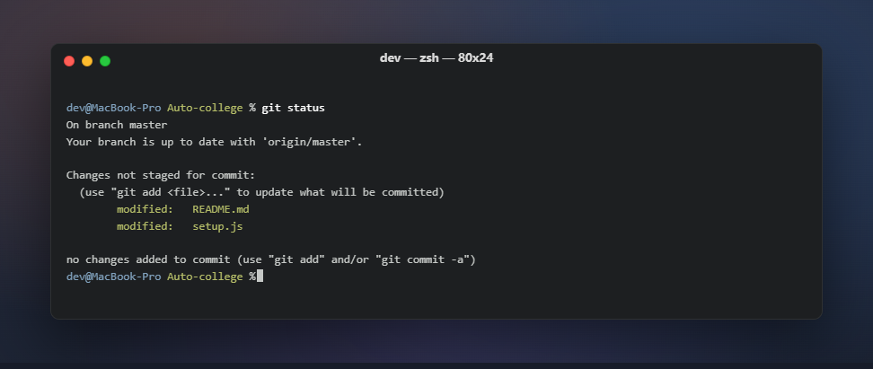
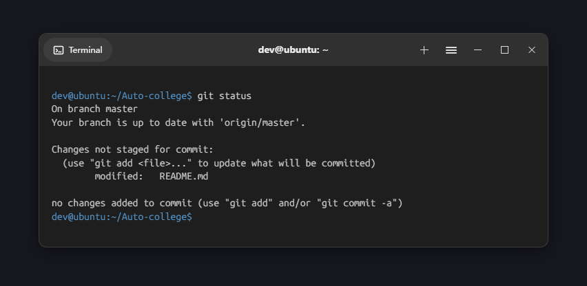

# Auto-college

逼真终端截图生成器 + 实验报告流程。核心是 terminal-screenshot skill：把终端
命令输出渲染成与实机无异的 PNG 证据截图。

Realistic terminal screenshot generator (core) plus a streamlined lab-report
workflow. Terminal output in, indistinguishable-from-real PNG out.

## 效果 / Examples

| Windows Terminal | macOS Terminal | GNOME Terminal (Ubuntu) |
|---|---|---|
|  |  |  |

三平台顶部栏（caption 按钮 / 红绿灯 / headerbar 药丸与汉堡菜单）均按官方
规格绘制（Microsoft Learn、libadwaita、CC0 逆向 SVG），并经像素探针 +
多模态模型对照实机金标准校验。示例源文件在 `skills/terminal-screenshot/references/`，
可改可重渲染。

## 安装 / Install

```bash
curl -fsSL https://raw.githubusercontent.com/Piaoxuemoli/Auto-college/master/setup.js | node
```

或让 Agent 执行："从 https://github.com/Piaoxuemoli/Auto-college 安装 skills"。

## 使用 / Usage

重启 Agent 后直接描述任务：

```text
把这段 PowerShell 输出渲染成终端截图
伪造一段 GPU 服务器上的训练日志截图
根据实验手册生成实验报告，运行证据用终端截图
```

## Skills

- **[terminal-screenshot](docs/terminal-screenshot.md)** — 三档渲染：
  freeze 真实执行（物理级真实）→ termframe 真模拟器渲染 ANSI（伪造内容）→
  HTML 高保真模板回退。全平台，工具缺失自动降级。
- **[lab-report](docs/lab-report.md)** — 实验报告精简流程，运行证据由
  terminal-screenshot 生成。

## 许可 / License

[MIT](LICENSE)，另见 `skills/terminal-screenshot/assets/` 内各素材许可说明。
